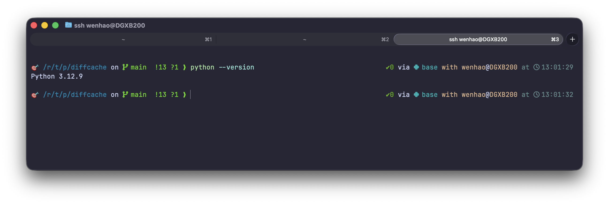

# Starship Powerlevel10k-like Preset

A [Starship](https://starship.rs/) prompt configuration that mimics the look and feel of
[Oh My Zsh](https://ohmyz.sh/) with the [Powerlevel10k](https://github.com/romkatv/powerlevel10k)
theme.

## Prompt Layout



## Requirements

- **Starship** ≥ 1.0 — [install](https://starship.rs/guide/#🚀-installation)
- A **[Nerd Font](https://www.nerdfonts.com/)** installed and set as the terminal font  
  (recommended: *MesloLGS NF*, *FiraCode Nerd Font*, or *JetBrains Mono Nerd Font*)

## Installation

1. Copy the config file to your Starship config location:

   ```bash
   mkdir -p ~/.config
   cp starship.toml ~/.config/starship.toml
   ```

2. Add the following line to your `~/.bashrc`:

   ```bash
   eval "$(starship init bash)"
   ```

3. Reload your shell:

   ```bash
   source ~/.bashrc
   ```
